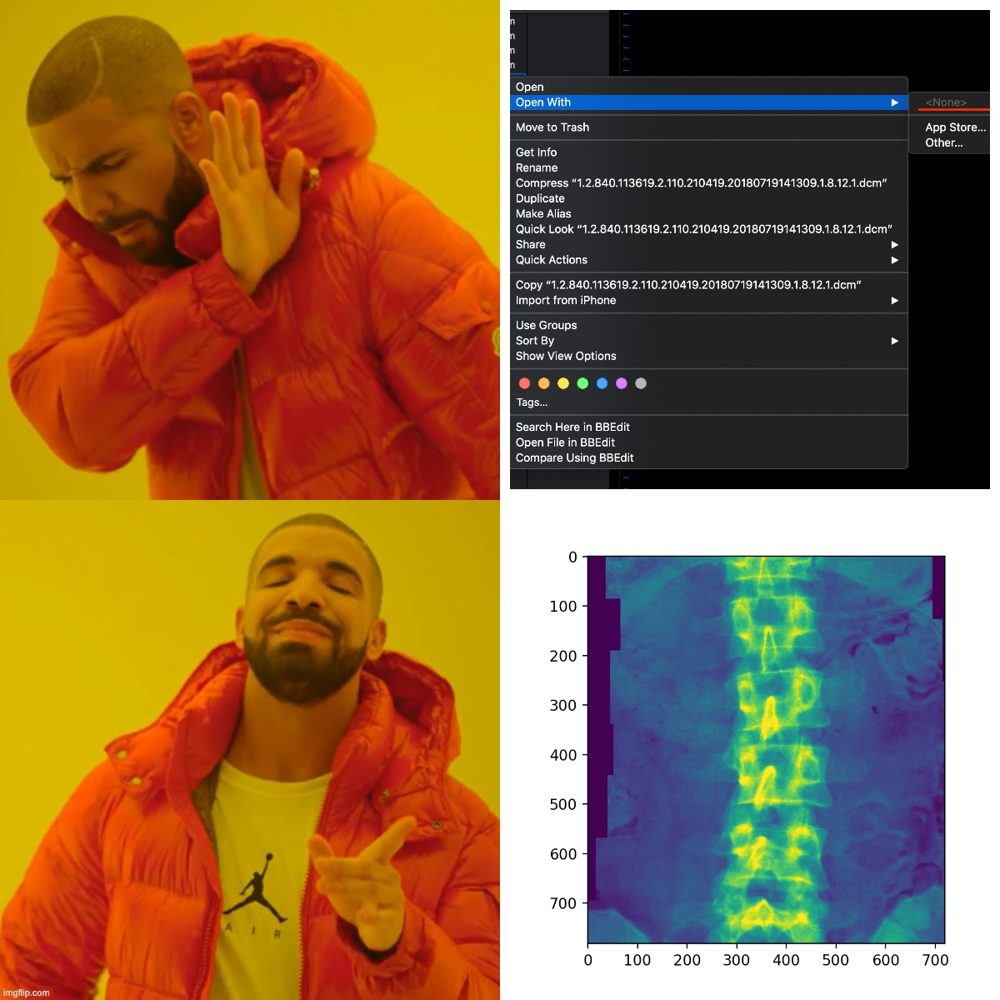

# dxaconv
## Convert DICOM files from DXA scans to other image formats, and parse the corresponding metadata files

Originally intended for DXA scans, but can also be used on any other DICOM formatted image as well (i.e. MRI).

Convert .dcm files to .jpg (or .png), preview images via matplotlib, and convert each file's corresponding metadata to a .txt file. Organize the output by anatomy (built in extensions compatible with dicom files from the United Kingdom National Health Service). Example dicom files used in this repo can be found [here](https://biobank.ctsu.ox.ac.uk/crystal/field.cgi?id=20158) as "eg_20158_dxa.zip".

This code builds upon the pydicom library and OpenCV libraries. Please refer [here](https://pydicom.github.io/pydicom/0.9/pydicom_user_guide.html) and [here](https://docs.opencv.org/master/d0/de3/tutorial_py_intro.html) for additional information on dependencies, the pydicom and OpenCV documentation.



# Command line exaamples

#### Convert DICOM files to JPG format
```
# while in a directory that contains all dicom images, use this command to convert them to JPGs in a new directory

python dxaconv.py dicom_directory jpg_directory

```
#### Organize by files of a particular anatomy 

```
# specify the path to a directory with dicom images, and the anatomy to filter by
 
python organizer.py dicom_directory spine

# it will output a text file containing all filenames for images of the spine

```
#### Anatomy arguments for organizer.py
```
hip1, hip2, knee1, knee2, spine, thoracic, full_body_opaque, full_body_transparent
```
